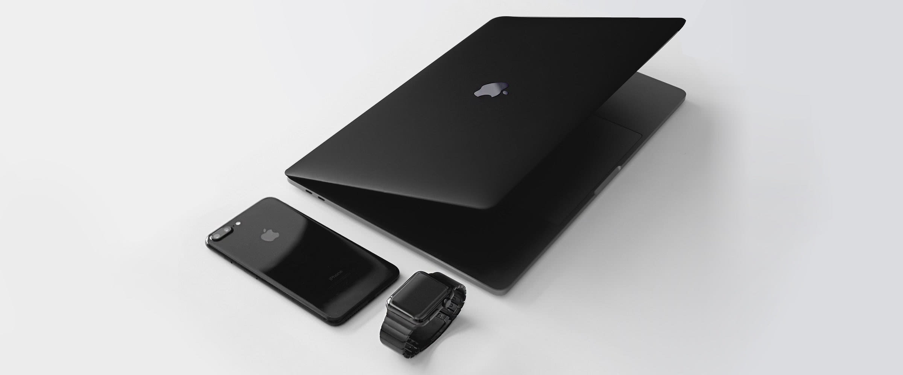
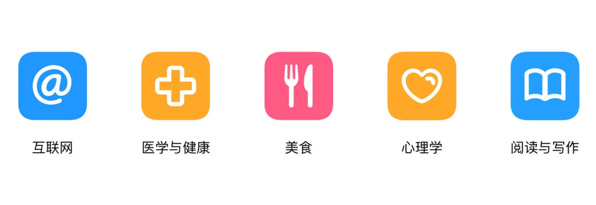
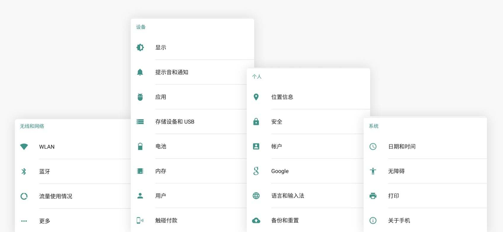
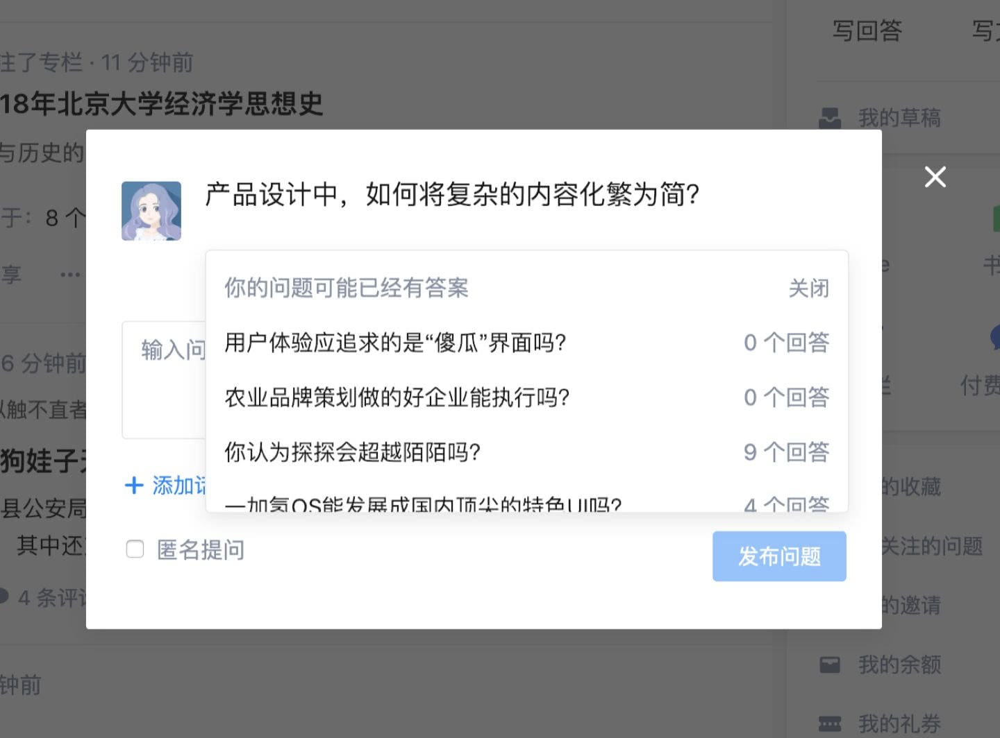
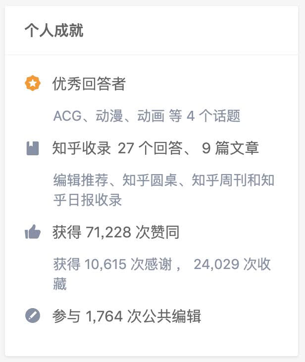
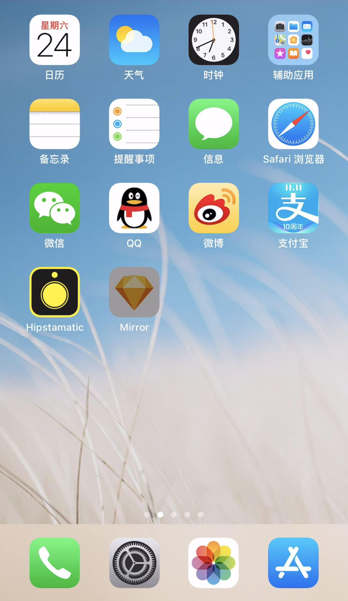
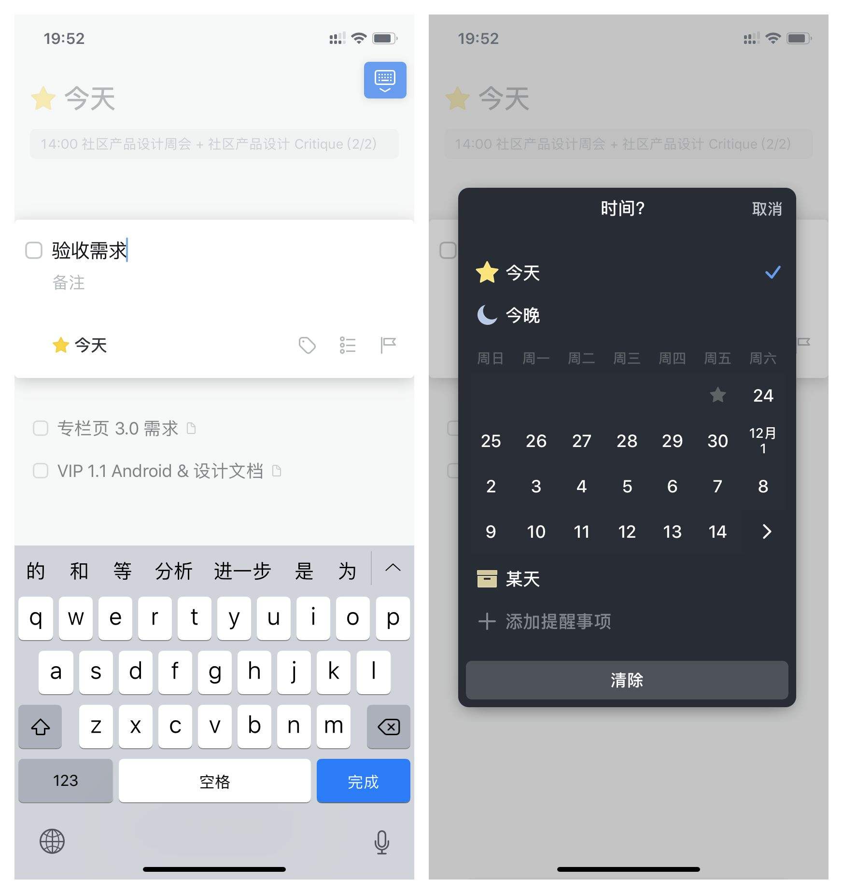
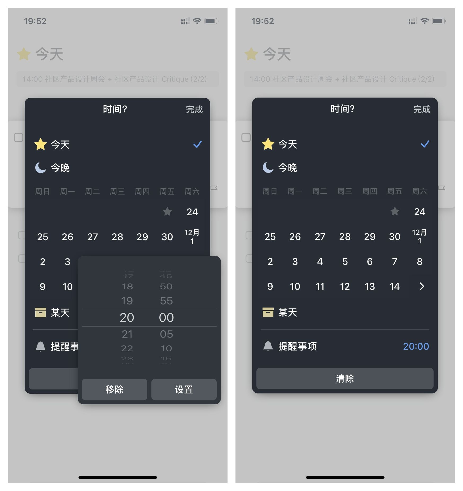
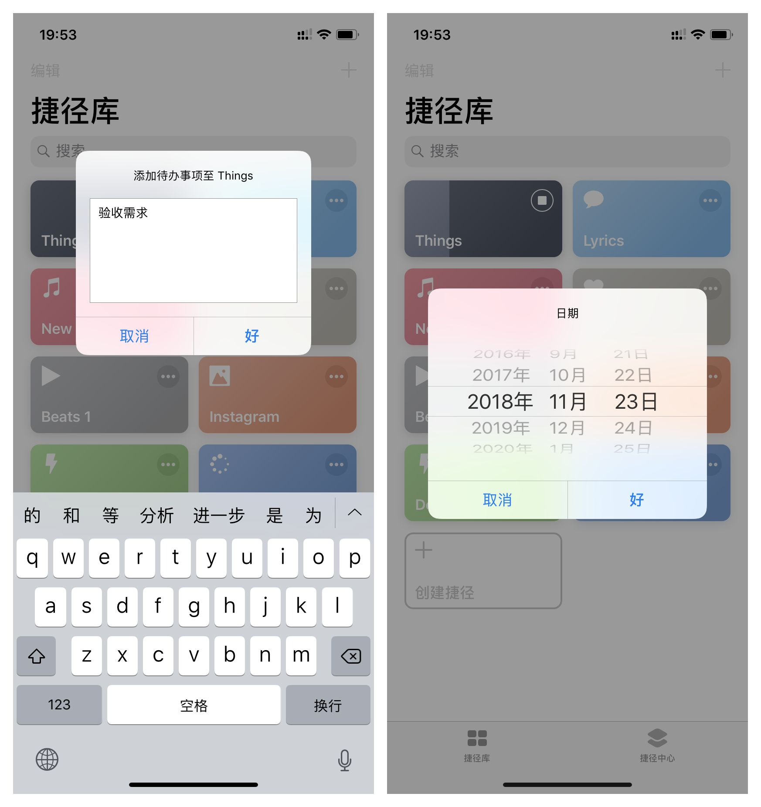
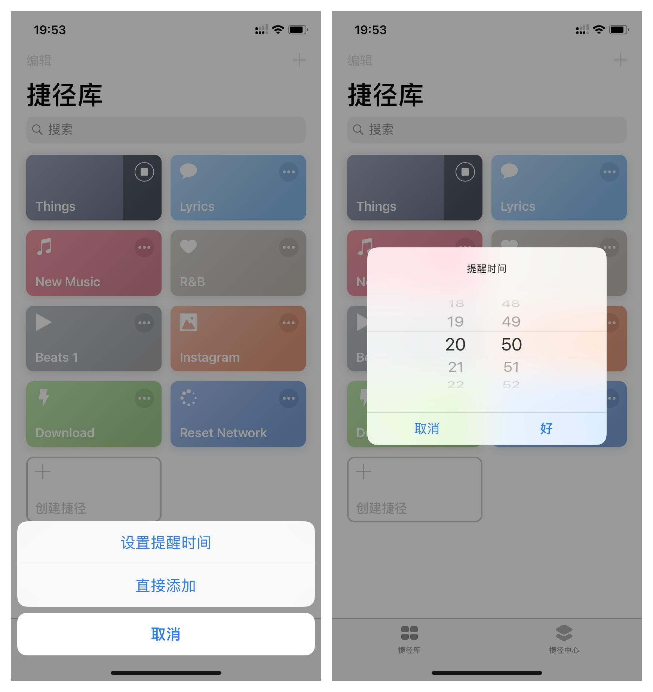

> 当你使用产品时遇到麻烦，那不是你的错，是产品设计出了问题。
> ——《设计心理学》

<!--more-->

我们在使用各种产品的过程中，可能多多少少都会遇到「不知道该怎么用」的情况。

前段时间刷微博，看到有个品牌的官博，放出一个顾客的留言，在抱怨他们家卖的某电子产品的保护套接缝不齐，结果是顾客自己戴反了。评论里有人嘲讽顾客的智商，我就想不通了，这难道不是保护套本身的设计有问题么？正反面长得那么像，又没有明确的标识，戴反了不是很正常么……

就像我永远无法一眼分清楚正反面的秋裤，真的是受够了……

------

我们还是来聊聊 app 吧。

电商产品也经常把功能做得无比复杂，比如说「双十一」淘宝的那个战队 PK 的活动。

朋友邀请我加入战队，打开页面一头雾水——我是谁、我在哪儿、我要干嘛……活动规则和参与方式写了好几屏，密密麻麻一堆小字……对不起，我真的看不懂到底怎么玩，打扰了……

「**设计出让用户看得懂，知道如何使用的产品。**」有时候真的比想象中难。

其实在工作过程中，很多产品经理和设计师们，都能隐约知道自己应该怎么做，但有时候对于「我们为什么要这么做」，可能并没有一个清晰的概念。

## 「化繁为简」的设计原则

《设计心理学》中提到了 7 个将任务化繁为简的设计原则：

1. 应用储存于外部世界和头脑中的知识
2. 简化任务的结构
3. 注重可视性，消除执行阶段和评估阶段的鸿沟
4. 建立正确的匹配关系
5. 利用自然和人为的限制性因素
6. 考虑可能出现的人为差错
7. 若无法做到以上个点，就采用标准化

书中针对每一项都有详细的说明，举的很多例子都是工业设计相关的，互联网产品涉及得很少，我就来给大家举一点 app 和网页设计相关的例子吧（最多的还是知乎，毕竟大家都在用）。

其中第 7 点，单看这句话可能会让人容易理解错，其实他的意思是「建立标准化」而不是「引用标准化的方法」，比如说当年统一键盘上按键的排列方式之类的。这一点在 app 设计中应用得比较少，我就先略过了，主要聊一聊前 6 点。

## 1. 应用储存于外部世界和头脑中的知识

在创造一些新产品、新功能的时候，如果能引入一些用户已经了解的概念，他们就会在刚接触产品时，就对它的定位有一个预期。

用户从在产品中获取到的信息，与他已有认知相关联，就能辅助他理解产品、完成操作。

比如说，新浪以前做了博客，用户可以发布长的图文内容；后来开始做「微博」，大家在用之前看到这个名字，就能推测出这可能是小的「博客」，写短内容的。

在设计中，更普遍、更典型的例子，就是图标的设计。

上图是一些经典的 icon，大家现在已经非常熟悉他们，对于他们的含义产生了共识。不过我们还是能看出来，最初它们被设计出来的时候，也是有很多的巧思。

比如说「齿轮」通常出现在机械的内部，用它来表示「设置」，仿佛就在说，你点这个按钮就可以看到产品内部的运行方式。

用老式座机的把手表示「通话」功能，让早期只用过座机的用户也能一眼就看出来。（年龄小的孩子可能已经不知道这是什么了……时代的眼泪……）

有时候甚至不需要看文字，就能知道它大概是哪类内容。必要的时候，好的 icon 可以代替冗长的文字来解释功能。

## 2. 简化任务的结构

认识一个新事物，人们需要把它放在短时记忆中加工，被反复复述的内容才会慢慢进入长时记忆，被存储起来。而人的短时记忆容量只有 7±2 个组块，保持的时间也就 5-20 秒。

如果想表达的东西太多太复杂，一次性全铺开给用户，是很难令其理解的，所以需要进行简化。

《设计心理学》一书中提到了好几种简化任务结构的方法，我针对互联网产品的设计做了一些调整——

**① 突出重要的内容，强调主次**

主要内容是知友相关的信息——头像、名字、在想法中的一些数据等等。而「为什么推荐给我——我关注的人关注了她」这个信息，是相对来说次要一些的信息，因此字号比较小。

**②** **将信息重新分组、编排，使之更好理解**

手边没有新的安卓设备，就截了老版原生系统的图。谷歌将设置中二十多个项目进行了分组，组的个数和组内的项目数都在 9 个以下。

**③** **简化操作的流程，取消部分操作或建立自动规则**

没有在知乎 PC 端网页提过问的朋友，可以去感受一下这个流程，我觉得体验还是很不错的。

发布提问的流程，正常情况下需要先搜索——看看站内是不是已经有类似的提问了，如果没有才开始创建问题，然后写问题表述、绑定话题等等……

经过产品设计优化之后的提问流程，我们可以直接填写问题，输入框下方就会自动「联想」站内类似的问题。关闭联想菜单后，系统会自动匹配相关话题。如果不需要修改，这个时候，我们只需要考虑「是否填写问题描述」即可。

## 3. 注重可视性，消除执行阶段和评估阶段的鸿沟

要想使「从理解到执行」的过程更顺畅，就需要给用户提供足够清晰的视觉线索。

以用户的 profile 页为例，通常这个页面需要承载的内容很多，有些是纯展示作用的，有些可以点击的。设计中我们需要「**用视觉元素，表达清楚哪些是可操作的，以及如何操作**」。

这次看个反例——这一点知乎就做得不够好了，你知道这里的有哪些元素是可以点击的么？

「ACG」「动漫」「动画」「27 个回答」「9 篇文章」「1,764 次公共编辑」分别对应着不同的落地页……

⬆ iOS 桌面点击 app 图标的触摸效果

「**把操作的结果明确地显示出来**」同样很重要，不管是 iOS 还是安卓，系统级的 app 都很重视这一点，即时的触摸视觉反馈能让用户清楚地知道自己的操作生效了。

## 4. 建立正确的匹配关系

以下相邻元素之间，需要有正确的匹配关系。

「产品的实际状态」-「用户感知到的状态」-「用户的意图、期望」-「用户的实际行为」-「最终的效果」

再举一个反例——iOS 中，从屏幕左侧向右划返回上一页，是非常常见的操作。正常情况下，右划时页面应该向右移动，但是微信小程序的页面是向下移动的。第一次使用会觉得很意外，当我下次尝试下拉退出页面时，发现下拉是刷新……

## 5. 利用自然和人为的限制性因素

复杂的功能，可以减少每一步操作所面临的选择，使用户只能看到正确的操作方法，以此保证得到有效的结果。

不知道大家有没有用过 Things，一个任务管理的应用，在里面创建 to-do 项目**有时**真的令人头大……

页面看上去倒是很简洁，创建一条 to-do，首先是需要输入内容，默认会创建在「今天」，你想改变日期时需要想一下，然后发现是点击左下角的「今天」。添加提醒也在这个入口的浮层里。

浮层面板的内容比较多，有很多操作的可能性，再次需要观察思考一下——该点哪个位置才能设置提醒时间。

好不容易把提醒时间加上了，还容易一不小心点了「清除」，又得重新来一遍……

几乎每一步都需要思考一下「我该点哪儿」……

我的朋友 [@Steve](https://www.zhihu.com/people/87c39b051911178ce45ec207c651d4ec) 用「捷径」优化了一下这个流程（可以找他要教程 🌚）——

第一步，填写 to-do 内容；第二步，设置日期，默认会显示今天的日期，不需要改的话点「好」就行了。

最后一步，如果需要的话——设置提醒时间。

虽然步骤并没有减少，但是每一步都只需要聚焦在当前这一件事上，省略了很多反应、思考的成本。

## 6. 考虑可能出现的人为差错

虽然我们做了很多努力来减少用户出错的可能性，但人为差错是很难完全避免的，因此有时需要考虑一些弥补手段——这个大家都很熟练了。

针对一些无法逆转的操作，一方面我们可以增加难度，比如说删除自己的回答时的二次确认。

另一方面，让用户能够比较容易地撤销错误操作。邮箱中，归档或删除邮件可能是比「在知乎删除回答」要频繁得多的操作，每次都「二次确认」就很烦（我又想到了在 iOS 中删短信，真的烦死了），因此 Gmail 中提供了一个「撤销」按钮，给你几秒钟反悔的机会。

------

如果每次做设计时，都能认真考虑到这些原则，应该就能做出更好的产品吧~

